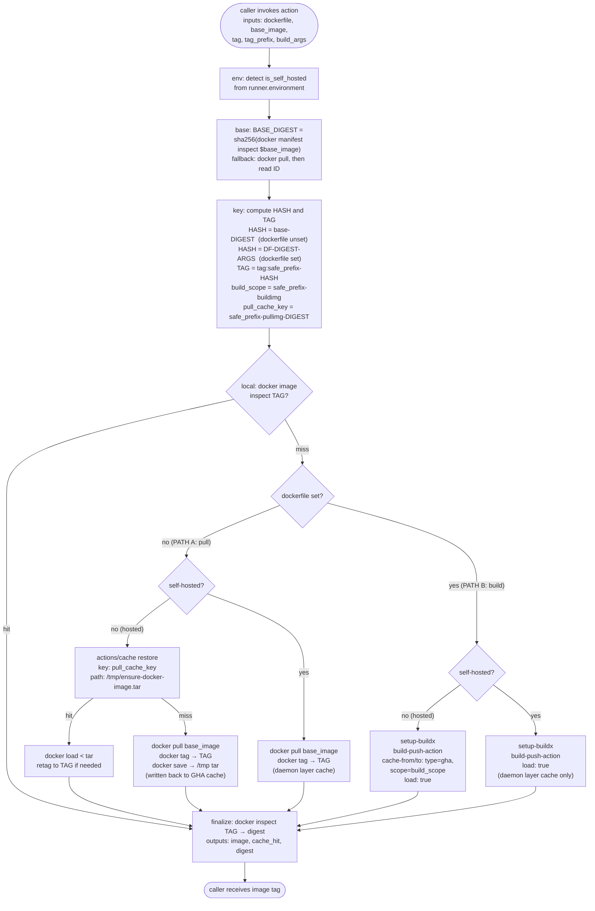

# ensure-docker-image

Idempotent composite action that **ensures a local docker image tag exists** — either by pulling a base image or by building a Dockerfile on top of it — with a unified caching story across **GitHub-hosted** and **self-hosted** runners. One set of inputs, one set of outputs, no runner-type branching in the caller. Fast-path skips all work when the content-hashed tag is already present.

## What it does

Two paths, selected by whether you pass a `dockerfile`:

| `dockerfile` input | Behavior |
|---|---|
| unset | Pulls `base_image`, tags it locally under a content-addressable tag, caches the tarball (GitHub-hosted) or relies on the docker daemon (self-hosted). Returns the tag. |
| set | Builds the Dockerfile (via Buildx + `docker/build-push-action`) with `base_image` as the FROM contract. GitHub-hosted uses Buildx's GHA layer cache (`type=gha`, scoped by `tag_prefix`); self-hosted uses the docker daemon's persistent local layer cache. Returns the tag. |

Fast path (both modes): if a local image with the computed content-hashed tag already exists, the build/pull step is skipped entirely.

## Flow



The reusable workflow `.github/workflows/ensure-docker-image.yml` is a thin wrapper that runs this composite on `[self-hosted, runner_label]` and surfaces `outputs.docker_image` to the caller workflow — useful when the prepared image must be handed to a downstream reusable workflow on the same runner.

## Inputs

| Input | Required | Default | Description |
|---|---|---|---|
| `dockerfile` | no | `""` | Dockerfile path (relative to `$GITHUB_WORKSPACE`). Unset = pull-and-tag mode. |
| `context` | no | `.` | Build context directory. Only used in build mode. |
| `build_args` | no | `""` | Newline-separated `KEY=VALUE`, forwarded to `--build-arg`. |
| `base_image` | **yes** | — | Image reference. Pulled and tagged locally in pull mode; used for content-hash stability in build mode. The action does not rewrite your Dockerfile's `FROM` — set `base_image` to match what your Dockerfile imports. |
| `tag` | no | `cached-image` | Local tag base. The action appends `<prefix>-<hash>`. |
| `tag_prefix` | **yes** | — | Project namespace; dual-purpose (tag partition on self-hosted, Buildx GHA cache scope on hosted). See [Tag prefix guidelines](#tag-prefix-guidelines). |

## Outputs

| Output | |
|---|---|
| `image` | Fully qualified local tag of the produced image. Pass this to `docker run`. |
| `cache_hit` | `true` if the local tag pre-existed and neither build nor pull ran; `false` otherwise. |
| `digest` | Local image ID (`sha256:...`). |

## Tag prefix guidelines

**You must supply `tag_prefix`.** There is no default. Picking the wrong value causes either cache collisions (distinct projects eating each other's entries) or cache thrash (same project, different prefix per workflow → no reuse).

### Why it's called "tag prefix" and why it also acts as a cache key

A single input plays two roles depending on runner type:

- **Self-hosted** → it's a **tag partition**. It appears in the local docker tag as `<tag>:<tag_prefix>-<hash>` so multiple projects sharing one daemon don't collide on the same tag name. There is no external cache; layer reuse happens via the daemon's local cache, which is content-addressable and does not need the prefix.
- **GitHub-hosted (build path)** → it's the **Buildx GHA cache scope** (`type=gha,scope=<tag_prefix>-buildimg`). Different projects → different scopes → no cross-project poisoning. Same project, Dockerfile evolves → same scope → buildx still reuses per-layer hashes, so edits don't invalidate everything.
- **GitHub-hosted (pull path)** → it's the **`actions/cache` key** for the pulled tarball (`<tag_prefix>-pullimg-<base-digest>`), partitioning the cache per project (cache quotas are per-repo anyway).

The name leans into the self-hosted framing because that's the one people intuit first; the hosted-runner cache-scope role is the natural additional duty of the same identifier.

Rules of thumb:
- **Namespace by repo**: `${{ github.repository }}-<purpose>`, e.g. `octocat/my-app-ci-img`.
- **Do not include volatile fields** like `github.sha`, `github.run_id`, or the date. The action already hashes Dockerfile content, build args, and base image digest into the tag — the prefix should stay **stable** across runs that should share a cache.
- **Distinguish purposes** if one repo builds multiple images: `${{ github.repository }}-test-img` vs `${{ github.repository }}-agent-img`.
- **Organization-wide images** shared across several repos can use a shared prefix, but only if you trust every workflow writing to it not to poison the cache.

## Usage

### Pull an image (unified across runner types)

```yaml
jobs:
  run:
    runs-on: ubuntu-latest     # or [self-hosted, my-label]
    steps:
      - uses: actions/checkout@v4
      - id: img
        uses: Clockwork-Pilot/autopilot/.github/actions/ensure-docker-image@main
        with:
          base_image:       ghcr.io/acme/runtime:latest
          tag_prefix: ${{ github.repository }}-runtime
      - run: docker run --rm ${{ steps.img.outputs.image }} my-command
```

### Build a Dockerfile

```yaml
- id: img
  uses: Clockwork-Pilot/autopilot/.github/actions/ensure-docker-image@main
  with:
    dockerfile:       Dockerfile.ci
    base_image:       ghcr.io/acme/runtime:latest
    tag_prefix: ${{ github.repository }}-ci-img
    build_args: |
      PYTHON_VERSION=3.12
      NODE_VERSION=22
- run: docker run --rm ${{ steps.img.outputs.image }} pytest
```

Same call shape on a self-hosted runner — the action detects `runner.environment` and drops the GHA cache layer automatically (docker daemon does it better on persistent disks).

## When to use this

- You want a single caching story for images across GitHub-hosted and self-hosted.
- You're layering extra tooling onto a pinned upstream image and want Buildx's layer cache "for free".
- You don't want to manually wire `docker login` / `docker pull` / `actions/cache` / `docker save` / `docker load` in every workflow.

## When not to use this

- You want to **publish** the image to a registry. This action only produces local tags. Use `docker/build-push-action` directly with `push: true` for publication.
- Your workflow builds many distinct images per run. Cache keying per-image is out of scope; wire `docker/build-push-action` per image.
