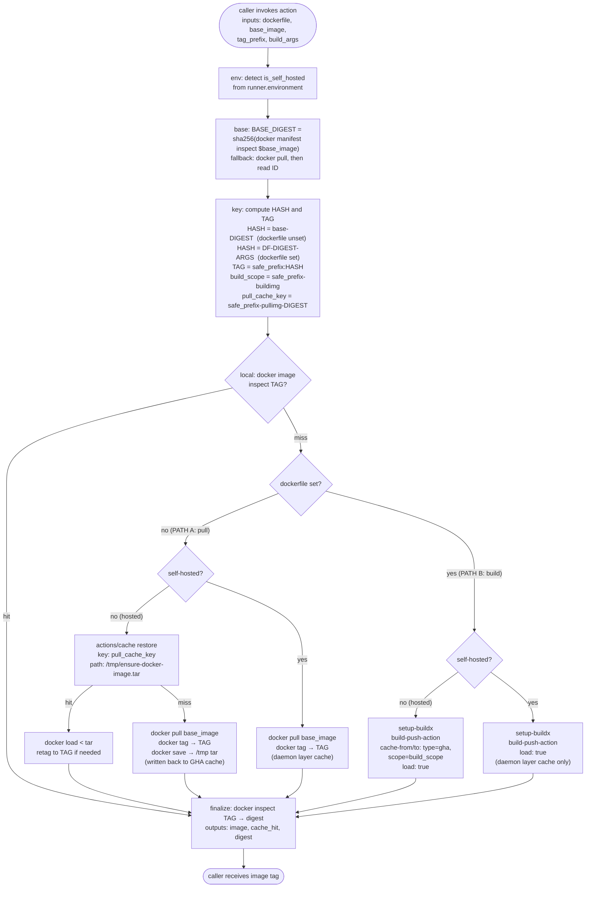

# ensure-docker-image

Idempotent composite action that **ensures a local docker image tag exists** — either by pulling a base image or by building a Dockerfile on top of it — with a unified caching story across **GitHub-hosted** and **self-hosted** runners. One set of inputs, one set of outputs, no runner-type branching in the caller. Fast-path skips all work when the content-hashed tag is already present.

## What it does

Two paths, selected by whether you pass a `dockerfile`:

| `dockerfile` input | Behavior |
|---|---|
| unset | Pulls `base_image`, tags it locally under a content-addressable tag, caches the tarball (GitHub-hosted) or relies on the docker daemon (self-hosted). Returns the tag. |
| set | Builds the Dockerfile (via Buildx + `docker/build-push-action`) with `base_image` as the FROM contract. GitHub-hosted uses Buildx's GHA layer cache (`type=gha`, scoped by `tag_prefix`); self-hosted uses the docker daemon's persistent local layer cache. Returns the tag. |

Fast path (both modes): if a local image with the computed content-hashed tag already exists, the build/pull step is skipped entirely.

## Flow


```mermaid
flowchart TD
    Start([caller invokes action<br/>inputs: dockerfile, base_image,<br/>tag_prefix, build_args])
    Start --> Env["env: detect is_self_hosted<br/>from runner.environment"]
    Env --> Base["base: BASE_DIGEST =<br/>sha256(docker manifest inspect $base_image)<br/>fallback: docker pull, then read ID"]
    Base --> Key["key: compute HASH and TAG<br/>HASH = base-DIGEST&nbsp;&nbsp;(dockerfile unset)<br/>HASH = DF-DIGEST-ARGS&nbsp;&nbsp;(dockerfile set)<br/>TAG = safe_prefix:HASH<br/>build_scope = safe_prefix-buildimg<br/>pull_cache_key = safe_prefix-pullimg-DIGEST"]
    Key --> Local{"local: docker image<br/>inspect TAG?"}
    Local -- hit --> Finalize
    Local -- miss --> Route{dockerfile set?}

    Route -- "no (PATH A: pull)" --> PullEnv{self-hosted?}
    Route -- "yes (PATH B: build)" --> BuildEnv{self-hosted?}

    PullEnv -- "no (hosted)" --> PullCacheTry["actions/cache restore<br/>key: pull_cache_key<br/>path: /tmp/ensure-docker-image.tar"]
    PullEnv -- "yes" --> PullSelf["docker pull base_image<br/>docker tag → TAG<br/>(daemon layer cache)"]
    PullCacheTry -- hit --> Load["docker load &lt; tar<br/>retag to TAG if needed"]
    PullCacheTry -- miss --> PullHosted["docker pull base_image<br/>docker tag → TAG<br/>docker save → /tmp tar<br/>(written back to GHA cache)"]

    BuildEnv -- "no (hosted)" --> BuildHosted["setup-buildx<br/>build-push-action<br/>cache-from/to: type=gha,<br/>scope=build_scope<br/>load: true"]
    BuildEnv -- "yes" --> BuildSelf["setup-buildx<br/>build-push-action<br/>load: true<br/>(daemon layer cache only)"]

    Load --> Finalize
    PullHosted --> Finalize
    PullSelf --> Finalize
    BuildHosted --> Finalize
    BuildSelf --> Finalize

    Finalize["finalize: docker inspect TAG → digest<br/>outputs: image, cache_hit, digest"]
    Finalize --> End([caller receives image tag])
```

The reusable workflow `.github/workflows/ensure-docker-image.yml` is a thin wrapper that runs this composite on `[self-hosted, runner_label]` and surfaces `outputs.docker_image` to the caller workflow — useful when the prepared image must be handed to a downstream reusable workflow on the same runner.

## Inputs

| Input | Required | Default | Description |
|---|---|---|---|
| `dockerfile` | no | `""` | Dockerfile path (relative to `$GITHUB_WORKSPACE`). Unset = pull-and-tag mode. |
| `context` | no | `.` | Build context directory. Only used in build mode. |
| `build_args` | no | `""` | Newline-separated `KEY=VALUE`, forwarded to `--build-arg`. |
| `base_image` | **yes** | — | Image reference. Pulled and tagged locally in pull mode; used for content-hash stability in build mode. The action does not rewrite your Dockerfile's `FROM` — set `base_image` to match what your Dockerfile imports. |
| `tag_prefix` | **yes** | — | Project namespace, single string with three roles. **(1) Docker tag (both runner types)**: produced local tag is `<tag_prefix>:<hash>`, the REPOSITORY column in `docker images`. **(2) Buildx GHA cache scope (hosted build)**: `type=gha,scope=<tag_prefix>-buildimg` — partitions layer cache per project. **(3) `actions/cache` key (hosted pull)**: `<tag_prefix>-pullimg-<base-digest>` — partitions the pulled-tarball cache per project. See [Tag prefix guidelines](#tag-prefix-guidelines). |

## Outputs

| Output | |
|---|---|
| `image` | Fully qualified local tag of the produced image. Pass this to `docker run`. |
| `cache_hit` | `true` if the local tag pre-existed and neither build nor pull ran; `false` otherwise. |
| `digest` | Local image ID (`sha256:...`). |

## Tag prefix guidelines

**You must supply `tag_prefix`.** No default. One string, used three places — picking the wrong value causes either cache collisions (distinct projects eating each other's entries) or cache thrash (same project, different prefix per workflow → no reuse).

### The three roles, by runner type

| Role | Where it appears | Runner type |
|---|---|---|
| Docker tag (REPOSITORY) | `<tag_prefix>:<hash>` in `docker images` | both |
| Buildx GHA cache scope | `type=gha,scope=<tag_prefix>-buildimg` | GitHub-hosted, build path |
| `actions/cache` key prefix | `<tag_prefix>-pullimg-<base-digest>` | GitHub-hosted, pull path |

On self-hosted runners only the first role applies (no external cache; the daemon's local layer cache is content-addressable and project-agnostic). The prefix still earns its keep there because **one daemon is shared across every repo that runs on that machine** — distinct prefixes keep `docker images` clean per project.

On GitHub-hosted runners, GitHub already isolates the Actions cache per repo at the platform level, so cross-repo poisoning isn't a risk. Within a single repo, the prefix differentiates *purposes* (e.g. one repo building both an agent image and a check image) so each gets its own cache scope.

### Rules of thumb

- **Pick something short and project-specific.** `agent-img`, `check-img`, `<purpose>-img`. Short prefixes keep `docker images` readable.
- **Distinguish purposes if one repo builds multiple images:** `agent-img` vs `check-img`.
- **Including `${{ github.repository }}`** (e.g. `${{ github.repository }}-agent-img`) is a defensive convention — useful when the workflow file is copy-pasted across many repos and you want each instance to self-namespace without manual editing. A hand-picked unique name is functionally equivalent.
- **Do not include volatile fields** like `github.sha`, `github.run_id`, or the date. The action already hashes Dockerfile content, build args, and base image digest into the tag — the prefix must stay **stable** across runs that should share a cache.
- **Organization-wide images** shared across several repos can use a shared prefix, but only if you trust every workflow writing to it not to poison the cache.

## Usage

### Pull an image (unified across runner types)

```yaml
jobs:
  run:
    runs-on: ubuntu-latest     # or [self-hosted, my-label]
    steps:
      - uses: actions/checkout@v4
      - id: img
        uses: Clockwork-Pilot/autopilot/.github/actions/ensure-docker-image@main
        with:
          base_image:       ghcr.io/acme/runtime:latest
          tag_prefix: ${{ github.repository }}-runtime
      - run: docker run --rm ${{ steps.img.outputs.image }} my-command
```

### Build a Dockerfile

```yaml
- id: img
  uses: Clockwork-Pilot/autopilot/.github/actions/ensure-docker-image@main
  with:
    dockerfile:       Dockerfile.ci
    base_image:       ghcr.io/acme/runtime:latest
    tag_prefix: ${{ github.repository }}-ci-img
    build_args: |
      PYTHON_VERSION=3.12
      NODE_VERSION=22
- run: docker run --rm ${{ steps.img.outputs.image }} pytest
```

Same call shape on a self-hosted runner — the action detects `runner.environment` and drops the GHA cache layer automatically (docker daemon does it better on persistent disks).

## When to use this

- You want a single caching story for images across GitHub-hosted and self-hosted.
- You're layering extra tooling onto a pinned upstream image and want Buildx's layer cache "for free".
- You don't want to manually wire `docker login` / `docker pull` / `actions/cache` / `docker save` / `docker load` in every workflow.

## When not to use this

- You want to **publish** the image to a registry. This action only produces local tags. Use `docker/build-push-action` directly with `push: true` for publication.
- Your workflow builds many distinct images per run. Cache keying per-image is out of scope; wire `docker/build-push-action` per image.
