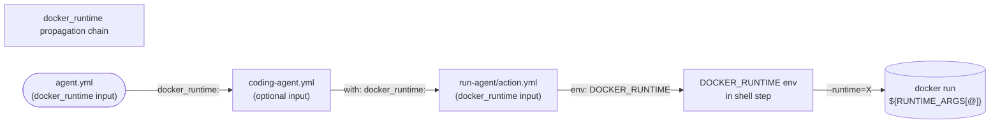

# Specification

## Overview

Workflow structure constraints for .github/workflows

## Table of Contents

- [Overview](#overview)
- [Feature: coding_agent_steps](#feature-coding_agent_steps)
  - [Constraint: coding_agent_inputs_minimal](#constraint-coding_agent_inputs_minimal)
  - [Constraint: dispatcher_fails_on_missing_step](#constraint-dispatcher_fails_on_missing_step)
  - [Constraint: docker_runtime_forwarded_to_run_agent](#constraint-docker_runtime_forwarded_to_run_agent)
- [Feature: docker_environment](#feature-docker_environment)
  - [Constraint: docker_required](#constraint-docker_required)
- [Feature: runner_cancellation](#feature-runner_cancellation)
  - [Constraint: docker_run_scripts_kill_container_on_cancel](#constraint-docker_run_scripts_kill_container_on_cancel)
- [Feature: step_output_checks](#feature-step_output_checks)
  - [Constraint: act_step_runner_choose_branch_job_uses_composite_action](#constraint-act_step_runner_choose_branch_job_uses_composite_action)
  - [Constraint: act_step_runner_parse_issue_job_uses_composite_action](#constraint-act_step_runner_parse_issue_job_uses_composite_action)
  - [Constraint: choose_branch_via_action](#constraint-choose_branch_via_action)
  - [Constraint: composite_actions_yaml_loadable](#constraint-composite_actions_yaml_loadable)
  - [Constraint: every_action_with_fixtures_has_negative_fixture](#constraint-every_action_with_fixtures_has_negative_fixture)
  - [Constraint: no_legacy_centralized_fixtures](#constraint-no_legacy_centralized_fixtures)
  - [Constraint: parse_issue_via_action](#constraint-parse_issue_via_action)
- [Feature: upstream_pr_isolation](#feature-upstream_pr_isolation)
  - [Constraint: open_upstream_pr_job_shape](#constraint-open_upstream_pr_job_shape)
  - [Constraint: run_agent_is_self_hosted](#constraint-run_agent_is_self_hosted)
  - [Constraint: same_repo_pr_excludes_upstream_mode](#constraint-same_repo_pr_excludes_upstream_mode)
  - [Constraint: upstream_environment_scoped_to_one_job](#constraint-upstream_environment_scoped_to_one_job)
  - [Constraint: upstream_pr_token_scoped_to_one_job](#constraint-upstream_pr_token_scoped_to_one_job)
- [Feature: workflow_hygiene](#feature-workflow_hygiene)
  - [Constraint: act_step_runner_relocated_out_of_workflows_dir](#constraint-act_step_runner_relocated_out_of_workflows_dir)
  - [Constraint: actionlint_config_in_test_workflows_dir](#constraint-actionlint_config_in_test_workflows_dir)
  - [Constraint: actionlint_passes](#constraint-actionlint_passes)
  - [Constraint: build_push_action_pinned_via_env](#constraint-build_push_action_pinned_via_env)
  - [Constraint: checkout_pinned_via_env](#constraint-checkout_pinned_via_env)
  - [Constraint: ensure_docker_image_uses_tag_prefix_not_tag](#constraint-ensure_docker_image_uses_tag_prefix_not_tag)
  - [Constraint: no_checkout_v4_in_workflows](#constraint-no_checkout_v4_in_workflows)
  - [Constraint: no_hardcoded_base_image](#constraint-no_hardcoded_base_image)
  - [Constraint: no_scripts_path_in_workflow_run_steps](#constraint-no_scripts_path_in_workflow_run_steps)
  - [Constraint: setup_buildx_action_pinned_via_env](#constraint-setup_buildx_action_pinned_via_env)

## Feature: coding_agent_steps
**Coding agent steps for workflow automation**

**Goals:**
- Entry point called identically by workflow and constraint

### Constraint: coding_agent_inputs_minimal

**Description:** Architectural: coding-agent.yml workflow_call.inputs must equal exactly {runner_label, issue_number, docker_image, extra_docker_args, docker_runtime}, with docker_image required. docker_runtime is optional (default ''); callers pass it when they need a non-default OCI runtime (e.g. --runtime=runsc for gVisor). Forbids legacy internal-prep inputs (base_image, agent_image, dockerfile, build_args, tag_prefix).

**Type:** Bash

**Command:**

```bash
F=$PROJECT_ROOT/.github/workflows/coding-agent.yml; KEYS=$(yq -r '.on.workflow_call.inputs | keys | .[]' "$F" | sort | tr '\n' ',' | sed 's/,$//'); EXPECTED=docker_image,docker_runtime,extra_docker_args,issue_number,runner_label; [ "$KEYS" = "$EXPECTED" ] || { echo "coding-agent.yml workflow_call.inputs = $KEYS (expected $EXPECTED)"; exit 1; }; [ "$(yq -r '.on.workflow_call.inputs.docker_image.required' "$F")" = true ] || { echo "docker_image must be required: true"; exit 1; }
```

### Constraint: dispatcher_fails_on_missing_step

**Description:** Negative: act-step-dispatch.sh must exit non-zero AND emit the missing-step error to stderr (not stdout) when the requested step does not exist

**Type:** Bash

**Command:**

```bash
cd $PROJECT_ROOT && ERR=$(.github/scripts/test/act-step-dispatch.sh coding-agent.yml nonexistent_step_xyz 2>&1 1>/dev/null); RC=$?; [ $RC -ne 0 ] && echo "$ERR" | grep -q "Step 'nonexistent_step_xyz' not found"
```

### Constraint: docker_runtime_forwarded_to_run_agent

**Description:** docker_runtime optional input must be wired all the way from coding-agent.yml → run-agent action → DOCKER_RUNTIME env var so callers can specify a non-default OCI runtime (e.g. --runtime=runsc for gVisor) without touching extra_docker_args.

**Type:** Bash

**Command:**

```bash
F=$PROJECT_ROOT/.github/workflows/coding-agent.yml; yq -e '.on.workflow_call.inputs | has("docker_runtime")' "$F" > /dev/null || { echo 'coding-agent.yml missing docker_runtime input'; exit 1; }; [ "$(yq -r '.on.workflow_call.inputs.docker_runtime.required // false' "$F")" != 'true' ] || { echo 'docker_runtime must be optional'; exit 1; }; A=$PROJECT_ROOT/.github/actions/run-agent/action.yml; yq -e '.inputs | has("docker_runtime")' "$A" > /dev/null || { echo 'run-agent/action.yml missing docker_runtime input'; exit 1; }; grep -q 'DOCKER_RUNTIME' "$A" || { echo 'run-agent/action.yml missing DOCKER_RUNTIME env'; exit 1; }
```



## Feature: docker_environment
**Constraint checks must run inside Docker container**

**Goals:**
- Ensure constraint checker only runs in Docker environment, not on bare host

### Constraint: docker_required

**Description:** Verify constraints are running inside an existing Docker container (/.dockerenv present). We are already in Docker — do not nest another container layer.

**Type:** Bash

**Command:**

```bash
test -f /.dockerenv || { echo 'Error: Constraints must run inside Docker container'; exit 1; }
```

## Feature: runner_cancellation
**Self-hosted runner must propagate GitHub workflow cancellation into the docker container, not orphan it.**

**Goals:**
- When GitHub cancels a workflow, the in-flight docker container must be killed, not left running.
- Without this, `docker run --rm` orphans the container — the daemon keeps it alive after the runner step is killed, so the agent finishes its turn anyway and consumes credits/produces side effects on a cancelled run.

### Constraint: docker_run_scripts_kill_container_on_cancel

**Description:** Both run-in-docker-*.sh scripts must capture the container id via `docker run --cidfile <file>` and install a `trap '... docker kill ...' EXIT INT TERM` so GitHub workflow cancellation actually stops the container. Without --cidfile + trap, `docker run --rm` orphans the container: the docker daemon keeps it running after the runner step is killed, the agent finishes its turn anyway, and the cancelled run still consumes credits and writes side effects.

**Type:** Bash

**Command:**

```bash
for f in "$PROJECT_ROOT"/.github/scripts/run-in-docker-claude.sh "$PROJECT_ROOT"/.github/scripts/run-in-docker-no-agent.sh; do grep -q -- '--cidfile' "$f" || { echo "$f: docker run must pass --cidfile so the container id can be captured for kill-on-cancel"; exit 1; }; grep -qE '^[[:space:]]*trap[[:space:]].*docker kill.*EXIT[[:space:]]+INT[[:space:]]+TERM' "$f" || { echo "$f: must install a trap on EXIT INT TERM that runs docker kill (otherwise GitHub cancellation orphans the container)"; exit 1; }; done
```

## Feature: step_output_checks
**Behavioral checks: dispatch a workflow step with a fixture input and assert its $GITHUB_OUTPUT matches fixture.**

**Goals:**
- One behavioral constraint per dispatchable step, using mktemp -d for isolation

### Constraint: act_step_runner_choose_branch_job_uses_composite_action

**Description:** Architectural: the choose-branch test job in act-step-runner.yml (relocated to .github/scripts/test/workflows/) must invoke the composite action via uses: ./.github/actions/choose-branch. Same gate as act_step_runner_parse_issue_job_uses_composite_action — keeps the harness exercising action.yml metadata. Strict equivalent of the legacy choose_branch_test_uses_composite_action constraint, updated for the new file location.

**Type:** Bash

**Command:**

```bash
F=$PROJECT_ROOT/.github/scripts/test/workflows/act-step-runner.yml; USES=$(yq -r '.jobs["choose-branch"].steps[] | select(.uses != null) | .uses' "$F"); echo "$USES" | grep -qx './.github/actions/choose-branch' || { echo "act-step-runner.yml job choose-branch must invoke the composite action via uses: ./.github/actions/choose-branch (got: $USES). Bypassing action.yml hides metadata bugs."; exit 1; }
```

### Constraint: act_step_runner_parse_issue_job_uses_composite_action

**Description:** Architectural: the parse-issue test job in act-step-runner.yml (relocated to .github/scripts/test/workflows/) must invoke the composite action via uses: ./.github/actions/parse-issue, not by open-coding run: bash .github/actions/parse-issue/script.sh. Forces every test run to load action.yml so malformed metadata fails the suite. Strict equivalent of the legacy parse_issue_test_uses_composite_action constraint, updated for the new file location.

**Type:** Bash

**Command:**

```bash
F=$PROJECT_ROOT/.github/scripts/test/workflows/act-step-runner.yml; USES=$(yq -r '.jobs["parse-issue"].steps[] | select(.uses != null) | .uses' "$F"); echo "$USES" | grep -qx './.github/actions/parse-issue' || { echo "act-step-runner.yml job parse-issue must invoke the composite action via uses: ./.github/actions/parse-issue (got: $USES). Bypassing action.yml hides metadata bugs."; exit 1; }
```

### Constraint: choose_branch_via_action

**Description:** Behavioral: choose-branch fixtures pass against the act-step-runner.yml wrapper. Replaces choose_branch_cases.

**Type:** Bash

**Command:**

```bash
cd $PROJECT_ROOT && bash .github/scripts/test/run-act-step-checks.sh act-step-runner.yml choose-branch
```

### Constraint: composite_actions_yaml_loadable

**Description:** Static: every .github/actions/*/action.yml must parse as valid YAML. Catches malformed flow-mapping descriptions, unclosed quotes, and similar metadata breaks that the behavioral fixture harness would miss when it bypasses action.yml.

**Type:** Bash

**Command:**

```bash
for f in $PROJECT_ROOT/.github/actions/*/action.yml; do python3 -c "import sys, yaml; yaml.safe_load(open(sys.argv[1]))" "$f" || { echo "Invalid YAML: $f"; exit 1; }; done
```

### Constraint: every_action_with_fixtures_has_negative_fixture

**Description:** Meta: every .github/actions/<name>/fixtures/ tree must contain at least one negative-*/ case. Generalizes parse_issue_has_negative_fixture and choose_branch_has_negative_fixture: any action with positive fixtures must also carry a live demonstration that the harness diff fires on mismatch. Future actions added with fixtures will be covered automatically.

**Type:** Bash

**Command:**

```bash
MISSING=""; for d in $PROJECT_ROOT/.github/actions/*/fixtures/; do [ -d "$d" ] || continue; ls -d "$d"negative-*/ >/dev/null 2>&1 || MISSING="$MISSING $(dirname $d | xargs basename)"; done; [ -z "$MISSING" ] || { echo "actions missing negative-*/ fixture:$MISSING. Each action with a fixtures/ dir must include at least one negative-* case so the harness diff is provably load-bearing."; exit 1; }
```

### Constraint: no_legacy_centralized_fixtures

**Description:** Negative: the legacy .github/scripts/test/fixtures/ tree must not exist. Fixtures live under .github/actions/<step>/fixtures/; this guards against partial reverts that would split fixtures across two locations.

**Type:** Bash

**Command:**

```bash
cd $PROJECT_ROOT && [ ! -e .github/scripts/test/fixtures ]
```

### Constraint: parse_issue_via_action

**Description:** Behavioral: parse-issue fixtures pass against the act-step-runner.yml wrapper which invokes .github/actions/parse-issue/script.sh. Replaces parse_issue_cases after refactor to composite action.

**Type:** Bash

**Command:**

```bash
cd $PROJECT_ROOT && bash .github/scripts/test/run-act-step-checks.sh act-step-runner.yml parse-issue
```

## Feature: upstream_pr_isolation
**Cross-repo PR creation is isolated from the self-hosted agent runner**

**Goals:**
- UPSTREAM_PR_TOKEN (PAT) is never available on the self-hosted runner where the agent executes code
- The upstream-pr environment and its secret are scoped to a single, minimal job

### Constraint: open_upstream_pr_job_shape

**Description:** Structural: open-upstream-pr must declare environment: upstream-pr, run on ubuntu-latest (never self-hosted), and gate its if: on BOTH has_new_commit and merge_into_upstream being 'true'.

**Type:** Bash

**Command:**

```bash
yq -e '.jobs["open-upstream-pr"].environment == "upstream-pr"' $PROJECT_ROOT/.github/workflows/coding-agent.yml >/dev/null && yq -e '.jobs["open-upstream-pr"]."runs-on" == "ubuntu-latest"' $PROJECT_ROOT/.github/workflows/coding-agent.yml >/dev/null && IF=$(yq -r '.jobs["open-upstream-pr"].if' $PROJECT_ROOT/.github/workflows/coding-agent.yml) && echo "$IF" | grep -q "has_new_commit == 'true'" && echo "$IF" | grep -q "merge_into_upstream == 'true'"
```

### Constraint: run_agent_is_self_hosted

**Description:** Structural: run-agent must include the self-hosted label in runs-on. The agent executes untrusted code; running it on a shared ubuntu-latest runner would co-locate that code with other GitHub-hosted jobs and violate the isolation model the PAT scoping depends on.

**Type:** Bash

**Command:**

```bash
yq -r '.jobs["run-agent"]."runs-on" | .[]' $PROJECT_ROOT/.github/workflows/coding-agent.yml | grep -qx self-hosted
```

### Constraint: same_repo_pr_excludes_upstream_mode

**Description:** Structural: any step outside the open-upstream-pr job that calls 'gh pr create' must be guarded by merge_into_upstream != 'true' in its if:. Prevents double-opening when upstream mode is active, regardless of which job hosts the fork-PR step.

**Type:** Bash

**Command:**

```bash
OUT=$(yq -r '.jobs | to_entries[] | select(.key != "open-upstream-pr") | .value.steps[]? | select(.run and (.run | test("gh pr create"))) | (.if // "")' $PROJECT_ROOT/.github/workflows/coding-agent.yml); [ -z "$OUT" ] || ! echo "$OUT" | grep -vqE "merge_into_upstream != 'true'"
```

### Constraint: upstream_environment_scoped_to_one_job

**Description:** Structural: exactly one job in coding-agent.yml may declare environment: upstream-pr. Adding the environment to the self-hosted agent job would re-expose the PAT.

**Type:** Bash

**Command:**

```bash
[ "$(yq -r '[.jobs[] | select(.environment == "upstream-pr")] | length' $PROJECT_ROOT/.github/workflows/coding-agent.yml)" = "1" ]
```

### Constraint: upstream_pr_token_scoped_to_one_job

**Description:** Structural: secrets.UPSTREAM_PR_TOKEN must appear in exactly the open-upstream-pr job and no other. Keeps the PAT out of the self-hosted runner.

**Type:** Bash

**Command:**

```bash
JOBS=$(yq -r '.jobs | to_entries[] | select(.value | tostring | test("secrets\\.UPSTREAM_PR_TOKEN")) | .key' $PROJECT_ROOT/.github/workflows/coding-agent.yml | sort -u); [ "$JOBS" = "open-upstream-pr" ]
```

## Feature: workflow_hygiene
**Workflows use SHA-pinned actions**

**Goals:**
- All action references must be pinned to full commit SHAs for reproducibility and security

### Constraint: act_step_runner_relocated_out_of_workflows_dir

**Description:** Architectural: act-step-runner.yml is a local act test harness, never triggered by GitHub. It must live under .github/scripts/test/workflows/ (not .github/workflows/) so GitHub does not register it as a real reusable workflow exposed to consumers, and so it is exempt from no_scripts_path_in_reusable_workflows (the dispatcher script lives next to it).

**Type:** Bash

**Command:**

```bash
[ ! -e "$PROJECT_ROOT/.github/workflows/act-step-runner.yml" ] && [ -f "$PROJECT_ROOT/.github/scripts/test/workflows/act-step-runner.yml" ]
```

### Constraint: actionlint_config_in_test_workflows_dir

**Description:** Architectural: actionlint.yaml must live next to the relocated act-step-runner.yml at .github/scripts/test/workflows/, not at .github/. Its only ignore-rules block targets the test harness file, so the config belongs with the file it scopes — and keeping it out of .github/ avoids implying that the project ships an actionlint config for consumer-facing workflows.

**Type:** Bash

**Command:**

```bash
[ ! -e "$PROJECT_ROOT/.github/actionlint.yaml" ] && [ -f "$PROJECT_ROOT/.github/scripts/test/workflows/actionlint.yaml" ]
```

### Constraint: actionlint_passes

**Description:** Static: actionlint (https://github.com/rhysd/actionlint) must report zero issues across all .github/workflows/*.yml files. Catches typos in ${{ needs.<job> }} references, mismatched composite action inputs, invalid context usage, and other structural issues that yq-only checks miss.

**Type:** Bash

**Command:**

```bash
cd $PROJECT_ROOT && actionlint .github/workflows/*.yml
```

### Constraint: build_push_action_pinned_via_env

**Description:** Security: every docker/build-push-action reference across .github/workflows/*.yml and .github/actions/**/*.yml must match $BUILD_PUSH_ACTION_VER (defined in project.k.json → specs.autopilot.envs). Single source of truth for the approved build-push-action pin; update there to rotate.

**Type:** Bash

**Command:**

```bash
BAD=$(grep -rhoE 'docker/build-push-action@[A-Za-z0-9._-]+' "$PROJECT_ROOT/.github/workflows/" "$PROJECT_ROOT/.github/actions/" 2>/dev/null | sort -u | grep -vx "$BUILD_PUSH_ACTION_VER" || true); [ -z "$BAD" ] || { echo "Non-approved docker/build-push-action refs: $BAD (expected $BUILD_PUSH_ACTION_VER)"; exit 1; }
```

### Constraint: checkout_pinned_via_env

**Description:** Security: every actions/checkout reference in workflows must match $CHECKOUT_VER (defined in project.k.json → specs.autopilot.envs). Single source of truth for the approved checkout pin; update there to rotate.

**Type:** Bash

**Command:**

```bash
for f in $PROJECT_ROOT/.github/workflows/*.yml; do yq --arg v "$CHECKOUT_VER" '[.jobs[].steps[]? | .uses? | select(. != null) | select(test("actions/checkout@")) | select(. != $v)] | length' "$f" | grep -q '^0$' || { echo "Non-approved checkout ref in $f (expected $CHECKOUT_VER)"; exit 1; }; done
```

### Constraint: ensure_docker_image_uses_tag_prefix_not_tag

**Description:** ensure-docker-image.yml workflow_call.inputs must include tag_prefix and must not include tag.

**Type:** Bash

**Command:**

```bash
F=$PROJECT_ROOT/.github/workflows/ensure-docker-image.yml; T=$(yq -r '.on.workflow_call.inputs | has("tag")' "$F"); P=$(yq -r '.on.workflow_call.inputs | has("tag_prefix")' "$F"); [ "$T" = false ] && [ "$P" = true ]
```

### Constraint: no_checkout_v4_in_workflows

**Description:** Negative: no .github/workflows/*.yml file may reference actions/checkout@v4

**Type:** Bash

**Command:**

```bash
! grep -rn "actions/checkout@v4" "$PROJECT_ROOT/.github/workflows/" --include="*.yml"
```

### Constraint: no_hardcoded_base_image

**Description:** Architectural: the autopilot-ws image reference must not appear in any workflow yml file — not as a default, not in a comment, not anywhere. The image must be supplied purely via a workflow/action input (base_image) by the consumer caller, so autopilot itself has no built-in coupling to any specific ghcr/registry ref.

**Type:** Bash

**Command:**

```bash
! grep -rE 'ghcr\.io/clockwork-pilot/autopilot-ws' $PROJECT_ROOT/.github/workflows/ --include='*.yml'
```

### Constraint: no_scripts_path_in_workflow_run_steps

**Description:** Negative: no `run:` step in any .github/workflows/*.yml may shell out to a `.github/scripts/...` path. The rule is not reusable-vs-not — it is about whose checkout sits at $GITHUB_WORKSPACE when `run:` executes. When a consumer invokes one of these workflows, actions/checkout pulls the consumer's repo into $GITHUB_WORKSPACE, so a relative `.github/scripts/foo.sh` resolves against the consumer's tree and fails with 'No such file or directory'. Scripts that need autopilot's own checkout must be invoked from composite actions under .github/actions/, where $GITHUB_ACTION_PATH points at the autopilot tree (e.g. `bash "$GITHUB_ACTION_PATH/../../scripts/foo.sh"`); composite actions are exempt and the regex does not match $GITHUB_ACTION_PATH usage. Past incident: coding-agent.yml's Agent commit step ran `bash .github/scripts/run-in-docker-claude.sh` and broke every consumer run.

**Type:** Bash

**Command:**

```bash
! grep -nE '^\s*run:.*\.github/scripts/' "$PROJECT_ROOT"/.github/workflows/*.yml
```

### Constraint: setup_buildx_action_pinned_via_env

**Description:** Security: every docker/setup-buildx-action reference across .github/workflows/*.yml and .github/actions/**/*.yml must match $SETUP_BUILDX_ACTION_VER (defined in project.k.json → specs.autopilot.envs). Single source of truth for the approved setup-buildx-action pin; update there to rotate.

**Type:** Bash

**Command:**

```bash
BAD=$(grep -rhoE 'docker/setup-buildx-action@[A-Za-z0-9._-]+' "$PROJECT_ROOT/.github/workflows/" "$PROJECT_ROOT/.github/actions/" 2>/dev/null | sort -u | grep -vx "$SETUP_BUILDX_ACTION_VER" || true); [ -z "$BAD" ] || { echo "Non-approved docker/setup-buildx-action refs: $BAD (expected $SETUP_BUILDX_ACTION_VER)"; exit 1; }
```